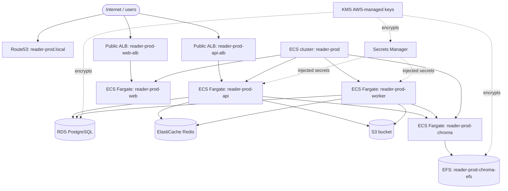

# AWS Architecture Map

Generated from live AWS CLI/API discovery for account **894650614733** in **us-east-1**.

Credential note: the shell had limited `reader-backend-s3-user` env credentials; the full discovery used the AWS CLI login credentials for `androso-admin` after unsetting the env access key override.

## High-level shape

## Inventory summary

| Area | Resources |
|---|---:|
| VPCs | 2 |
| Subnets | 10 |
| Internet gateways | 2 |
| NAT gateways | 1 |
| VPC endpoints | 1 |
| Security groups | 14 |
| Application load balancers | 2 |
| ECS clusters | 1 |
| ECS Fargate services | 4 |
| Running ECS tasks | 4 |
| EC2 instances | 0 |
| Auto Scaling groups | 0 |
| RDS instances | 1 |
| ElastiCache clusters | 1 |
| EFS file systems | 1 |
| S3 buckets | 1 |
| Route53 hosted zones | 1 |
| CloudFormation active stacks | 2 |
| CloudFront distributions | 0 |
| API Gateway APIs | 0 |
| SQS queues | 0 |
| SNS topics | 0 |
| IAM users | 2 |
| IAM roles | 12 |
| KMS keys | 4 |
| Secrets Manager secrets | 14 |
| CloudWatch log groups | 6 |

## Network

### Production VPC: `vpc-0dbad7a7403ef4dc6` (`reader-prod-vpc`)

- CIDR: `10.0.0.0/16`
- Non-default VPC.
- Internet gateway: `igw-0e1fa3e6de9c45a08`
- NAT gateway: `nat-1cfbc692e35d5879a`, state `available`, EIP `100.50.227.225`
- S3 gateway endpoint: `vpce-05ad8976e079796a3` (`com.amazonaws.us-east-1.s3`)

Subnets:

| Subnet | Name | AZ | CIDR | Role |
|---|---|---|---|---|
| `subnet-042b9f9d48080553a` | `reader-prod-subnet-public1-us-east-1a` | us-east-1a | `10.0.0.0/20` | public ALB |
| `subnet-02b2440b69cdcd015` | `reader-prod-subnet-public2-us-east-1b` | us-east-1b | `10.0.16.0/20` | public ALB |
| `subnet-06f412d0940aa31ce` | `reader-prod-subnet-private1-us-east-1a` | us-east-1a | `10.0.128.0/20` | private ECS/RDS/EFS |
| `subnet-00be6f05068007d33` | `reader-prod-subnet-private2-us-east-1b` | us-east-1b | `10.0.144.0/20` | private ECS/RDS/EFS |

Routing:

- Public route table `rtb-032ebe719d9f3c333`: `0.0.0.0/0 -> igw-0e1fa3e6de9c45a08`; associated to both public subnets.
- Private route tables `rtb-0fa08b7a015096355` and `rtb-00f2078737d80989f`: `0.0.0.0/0 -> nat-1cfbc692e35d5879a`; S3 prefix list `pl-63a5400a -> vpce-05ad8976e079796a3`.
- VPC main route table `rtb-054bfd1b9435e4dcf`: local only.

### Default VPC: `vpc-05b3215dcc764dadc`

- CIDR: `172.31.0.0/16`
- Default VPC, six public subnets across us-east-1a through us-east-1f.
- Internet gateway: `igw-0e1cfd61bb76521ea`
- No discovered app resources attached in this map.

## Security groups

| SG | Name | Purpose / ingress |
|---|---|---|
| `sg-0976b6cd29209796f` | `reader-api-alb-sg` | public API ALB; ingress `80,443` from `0.0.0.0/0` |
| `sg-0d0a71195b756aa1e` | `reader-web-alb-sg` | public web ALB; ingress `80,443` from `0.0.0.0/0` |
| `sg-0f749fbe5d3155497` | `reader-prod-web-alb-sg` | public web ALB; ingress `80` from `0.0.0.0/0` |
| `sg-06f861310100d3103` | `reader-ecs-tasks-sg` | ECS tasks; ingress `3000` from `sg-0976b6cd29209796f` |
| `sg-05758387bf7e6434f` | `reader-api-sg` | API ECS tasks; ingress `3000` from `sg-0976b6cd29209796f` |
| `sg-04b05efd19e3948f8` | `reader-prod-web-task-sg` | web ECS task; ingress `3000` from `sg-0f749fbe5d3155497` |
| `sg-0cf4519a2173c9007` | `reader-worker-sg` | worker ECS tasks; no ingress shown, all egress |
| `sg-0ba84dea5e131e0a0` | `reader-web-sg` | web ECS tasks; ingress `3000` from `sg-0d0a71195b756aa1e` |
| `sg-00632ac3dbf8d47c1` | `reader-chroma-sg` | Chroma service; ingress `8000` from API/worker/ECS task SGs |
| `sg-022520210d5522921` | `reader-rds-sg` | Postgres; ingress `5432` from API/worker/ECS task SGs |
| `sg-0467e162d5212db21` | `reader-redis-sg` | Redis; ingress `6379` from API/worker/ECS task SGs |
| `sg-0b4f9556fbedb055c` | `reader-efs-sg` | EFS; ingress `2049` from `sg-00632ac3dbf8d47c1` |
| `sg-0a9533e3e21c23c94` | default in prod VPC | self-ingress only |
| `sg-09ff1303e7b590780` | default in default VPC | self-ingress only |

## Compute

### ECS cluster: `reader-prod`

- Status: `ACTIVE`
- Launch mode: Fargate services/tasks; no EC2 container instances.
- Active services: 4
- Running tasks: 4

| Service | Desired/Running | Task definition | Subnets | Security groups | Load balancer |
|---|---:|---|---|---|---|
| `reader-prod-api` | 1 / 1 | `reader-prod-api:5` | private1/private2 | `sg-06f861310100d3103` | `reader-prod-api-tg` |
| `reader-prod-web` | 1 / 1 | `reader-prod-web:5` | private1/private2 | `sg-04b05efd19e3948f8` | `reader-prod-web-tg` |
| `reader-prod-worker` | 1 / 1 | `reader-prod-worker:4` | private1/private2 | `sg-06f861310100d3103` | none |
| `reader-prod-chroma` | 1 / 1 | `reader-prod-chroma:1` | private1/private2 | `sg-00632ac3dbf8d47c1` | none |

Running tasks:

- `0effc6c5d4404e61a5b5ea93db4b9306`: `reader-prod-worker:4`, container `worker`, `RUNNING`
- `a0d3fdd9884a4a8fbbb4d323689cc779`: `reader-prod-chroma:1`, container `chroma`, `RUNNING`
- `dc940e976c974b77a81469b737d00d07`: `reader-prod-api:5`, container `api`, `RUNNING`
- `fcf7b960737d4077bb50c3c77dc853fd`: `reader-prod-web:5`, container `web`, `RUNNING`

Task definitions:

| Family | CPU | Memory | Image | Ports | Secrets injected |
|---|---:|---:|---|---|---|
| `reader-prod-api:5` | 1024 | 2048 | `894650614733.dkr.ecr.us-east-1.amazonaws.com/reader-api:latest` | `3000/tcp` | AWS keys, DB, Redis, JWT, OpenAI, Google OAuth, S3 config |
| `reader-prod-web:5` | 1024 | 2048 | `894650614733.dkr.ecr.us-east-1.amazonaws.com/reader-web:latest` | `3000/tcp` | none listed |
| `reader-prod-worker:4` | 1024 | 2048 | `894650614733.dkr.ecr.us-east-1.amazonaws.com/reader-worker:latest` | `80/tcp` | AWS keys, DB, Redis, OpenAI, S3 config |
| `reader-prod-chroma:1` | 1024 | 2048 | `chromadb/chroma:latest` | `8000/tcp` | none listed |

### Load balancers

#### `reader-prod-api-alb`

- Type: application ALB, internet-facing, active.
- DNS: `reader-prod-api-alb-1574021502.us-east-1.elb.amazonaws.com`
- VPC: `vpc-0dbad7a7403ef4dc6`
- Subnets: public subnets in us-east-1a and us-east-1b.
- Security group: `sg-0976b6cd29209796f`
- Listener: HTTP `:80` -> `reader-prod-api-tg`
- Target group: `reader-prod-api-tg`, HTTP `:3000`, target type `ip`, health check `/health`, targets `1/1 healthy`.

#### `reader-prod-web-alb`

- Type: application ALB, internet-facing, active.
- DNS: `reader-prod-web-alb-421299030.us-east-1.elb.amazonaws.com`
- VPC: `vpc-0dbad7a7403ef4dc6`
- Subnets: public subnets in us-east-1a and us-east-1b.
- Security group: `sg-0f749fbe5d3155497`
- Listener: HTTP `:80` -> `reader-prod-web-tg`
- Target group: `reader-prod-web-tg`, HTTP `:3000`, target type `ip`, health check `/`, targets `1/1 healthy`.

### ECR repositories

- `reader-api`: `894650614733.dkr.ecr.us-east-1.amazonaws.com/reader-api`
- `reader-worker`: `894650614733.dkr.ecr.us-east-1.amazonaws.com/reader-worker`
- `reader-web`: `894650614733.dkr.ecr.us-east-1.amazonaws.com/reader-web`

### Not present

- EC2 instances: none discovered.
- Auto Scaling groups: none discovered.
- Lambda functions: none discovered.
- EKS clusters: none discovered.

## Data and storage

### RDS PostgreSQL

- Identifier: `reader-prod-postgres`
- Engine: PostgreSQL `18.3`
- Class: `db.t4g.micro`
- Status: `available`
- Endpoint: `reader-prod-postgres.c4h6imsgsgke.us-east-1.rds.amazonaws.com:5432`
- VPC: `vpc-0dbad7a7403ef4dc6`
- Subnet group: `default-vpc-0dbad7a7403ef4dc6`
- Subnets: `subnet-00be6f05068007d33`, `subnet-042b9f9d48080553a`, `subnet-02b2440b69cdcd015`, `subnet-06f412d0940aa31ce`
- Publicly accessible: `False`
- Storage: `20 GB gp3`
- Multi-AZ: `False`
- Security group: `sg-022520210d5522921`
- Encryption key: AWS-managed RDS key `alias/aws/rds`.

### ElastiCache Redis

- Cluster: `reader-prod-redis-001`
- Engine: Redis `7.1.0`
- Node type: `cache.t4g.micro`
- Status: `available`
- Node endpoint: `reader-prod-redis-001.i6a09i.0001.use1.cache.amazonaws.com:6379`
- Security group: `sg-0467e162d5212db21`

### EFS

- File system: `fs-091fd6cd9b2ab3089`
- Name: `reader-prod-chroma-efs`
- State: `available`
- KMS key: `alias/aws/elasticfilesystem`
- Mount targets:
  - `fsmt-089987e531ed874da`: `subnet-06f412d0940aa31ce`, IP `10.0.136.127`, SG `sg-0b4f9556fbedb055c`
  - `fsmt-0fb8955a961222d8d`: `subnet-00be6f05068007d33`, IP `10.0.157.171`, SG `sg-0b4f9556fbedb055c`

### S3

- Bucket: `reader-backend-894650614733-us-east-1-an`
- Region: `us-east-1` (`get-bucket-location` returned `null`, AWS's us-east-1 representation)
- Created: `2026-05-25T21:01:03+00:00`
- Encryption: SSE-S3 `AES256`
- Public access block: all four protections enabled.
- Tags: `project=reader`
- Objects sampled: 1 key, `pdf-pdf_3a9a9b2d`

## DNS and edge

### Route53

Hosted zone: `reader-prod.local.` (`Z01714833FF09CLRB68OY`)

Records:

- `reader-prod.local.` NS
- `reader-prod.local.` SOA
- `chroma.reader-prod.local.` A -> `10.0.154.122`

### Not present

- CloudFront distributions: none discovered.
- API Gateway REST APIs: none discovered.
- API Gateway HTTP/WebSocket APIs: none discovered.
- ACM certificates: none discovered.

## Messaging and async integration

- SQS queues: none discovered.
- SNS topics: none discovered.
- DynamoDB tables: none discovered.
- SSM parameters: none discovered.

## CloudFormation

Active stacks:

- `Infra-ECS-Cluster-reader-prod-774f59fd` — `CREATE_COMPLETE`
- `ECS-Console-V2-Service-reader-prod-chroma-reader-prod-c84f6a00` — `CREATE_COMPLETE`

## IAM and security

### IAM users

- `androso-admin`: member of `Administrators`; attached policy `IAMUserChangePassword`.
- `reader-backend-s3-user`: attached policy `AmazonS3FullAccess`.

### IAM roles

Service-linked roles:

- `AWSServiceRoleForAmazonElasticFileSystem`
- `AWSServiceRoleForBackup`
- `AWSServiceRoleForECS`
- `AWSServiceRoleForElastiCache`
- `AWSServiceRoleForElasticLoadBalancing`
- `AWSServiceRoleForNATGateway`
- `AWSServiceRoleForRDS`
- `AWSServiceRoleForResourceExplorer`
- `AWSServiceRoleForSupport`
- `AWSServiceRoleForTrustedAdvisor`

Application/deployment roles:

- `ecsTaskExecutionRole`
  - Attached: `AmazonECSTaskExecutionRolePolicy`
  - Inline: `ReaderProdSecretsAccess`
- `reader-github-actions-deploy-role`
  - Inline: `ReaderGitHubActionsDeployPolicy`

Customer-managed standalone IAM policies: none discovered.

### KMS keys

- `alias/aws/rds` — AWS-managed, enabled.
- `alias/aws/elasticfilesystem` — AWS-managed, enabled.
- `alias/aws/backup` — AWS-managed, enabled.
- `alias/aws/secretsmanager` — AWS-managed, enabled.

### Secrets Manager

Secrets discovered, names only; values were not read:

- `reader/prod/DATABASE_URL`
- `reader/prod/REDIS_URL`
- `reader/prod/JWT_SECRET`
- `reader/prod/OPENAI_API_KEY`
- `reader/prod/CHROMA_SERVER_AUTHN_CREDENTIALS`
- `reader/prod/CHROMA_CLIENT_AUTH_CREDENTIALS`
- `reader/prod/GOOGLE_CLIENT_ID`
- `reader/prod/GOOGLE_CLIENT_SECRET`
- `reader/prod/S3_BUCKET_NAME`
- `reader/prod/S3_ENDPOINT`
- `reader/prod/S3_REGION`
- `reader/prod/AWS_ACCESS_KEY_ID`
- `reader/prod/AWS_SECRET_ACCESS_KEY`
- `reader/prod/FRONTEND_URL`

## Observability

CloudWatch log groups discovered:

- `/aws/ecs/containerinsights/reader-prod/performance`
- `/ecs/reader-prod/api`
- `/ecs/reader-prod/chroma`
- `/ecs/reader-prod/migration`
- `/ecs/reader-prod/web`
- `/ecs/reader-prod/worker`

## Notes and risks

- Both public ALBs have HTTP listeners on port `80`. No ACM certificates were discovered, and HTTPS listeners were not observed in the queried ALB listener output.
- ECS app tasks run in private subnets and reach the internet via the NAT gateway.
- RDS, Redis, Chroma, and EFS are private-only based on discovered subnet/security-group placement.
- The default VPC still exists but no application resources were discovered there.
- The `reader-backend-s3-user` environment credentials are much narrower than the login credentials; use the login/admin credential source for future full-account discovery.
