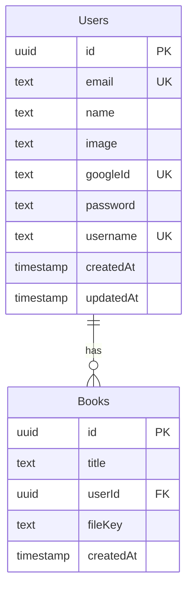

# Database Schema

```mermaid
erDiagram
    Users {
        uuid id PK
        text email UK
        text name
        text image
        text googleId UK
        text password
        text username UK
        timestamp createdAt
        timestamp updatedAt
    }
    Books {
        uuid id PK
        text title
        uuid userId FK
        text fileKey
        timestamp createdAt
    }
    Users ||--o{ Books : "has"
```
